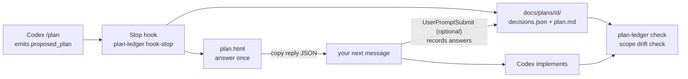

<h1 align="center">codex-plan-ledger</h1>

<p align="center">
  <strong>Answer every decision in a Codex <code>/plan</code> on one page, keep them in your repo, and check for drift after the code is written.</strong>
</p>

<p align="center">
  Keep using Codex's native Plan mode. When the plan arrives, you get one offline HTML page with every decision on it, answered in one go. The answers land in <code>docs/plans/&lt;id&gt;/decisions.json</code>, so they can be diffed and reviewed in PRs. After implementation, a scope drift check compares the change with the plan.
</p>

<p align="center">
  <a href="./skills/plan-ledger/SKILL.md">Skill</a> ·
  <a href="./schema/decisions.schema.json">Schema</a> ·
  <a href="./docs/measurement-plan.md">Measurement plan</a> ·
  <a href="./README.md">简体中文</a> · <strong>English</strong>
</p>

<p align="center">
  <code>npm i -g github:miniLV/codex-plan-ledger && plan-ledger init --write</code>
</p>

<p align="center">
  Codex CLI · Node.js 20+ · zero dependencies · no extra model calls · MIT
</p>

<p align="center">
  
</p>

> **Status: early prototype, v0.1.** It works and is covered by tests. There is one directional measured round so far (1 task, 1 run per arm, n = 1 pair). That is **not enough to claim saved rounds or tokens**; see [Measured (round 1)](#measured-round-1-directional-n--1-pair) below. The figure above is illustrative, not a measurement. How it will be measured, and what counts as success, is in the [measurement plan](docs/measurement-plan.md).

<p align="center">
  
  <br><sub>Decision page, captured with headless Chrome. The content comes from the synthetic fixture <code>test/fixtures/send-later.message.md</code>.</sub>
</p>

## What it is

| Part | What it does |
| --- | --- |
| `plan-ledger hook-stop` | Codex `Stop` hook. Takes the `<proposed_plan>` from `last_assistant_message` (or, when it is not there, from the session transcript at `transcript_path`; see "Findings" below), renders one HTML page from plain templates, writes `decisions.json` and `plan.md`, prints the HTML path, and lets the turn end normally. **It never blocks and never waits for you.** |
| Decision page `plan.html` | One offline file with no external resources. A summary row ("N decisions for you"), one card per decision with its options, the plan's recommendation and the affected files, and a "Build reply JSON and copy" button with the hint "Paste it into your next Codex message". The page UI defaults to Chinese; set `PLAN_LEDGER_LANG=en` or pass `--lang en`. |
| Decision ledger `decisions.json` | Versioned JSON (`schema_version`) with a [JSON Schema](schema/decisions.schema.json) and a validator. It ships in the same PR as the code, so reviewers see what was chosen and why. |
| `plan-ledger check` | Scope drift check: compares `git diff` with each decision's `affected` files. Reports changed files outside the plan, and decisions whose files were never touched. |
| `plan-ledger hook-prompt` | Optional `UserPromptSubmit` hook (experimental). `ledger:apply` injects the latest decisions into context; a pasted reply JSON is recorded in the ledger. |
| `skills/plan-ledger` | Manual fallback when hooks are not installed or not trusted: give the plan to the skill and it runs the same renderer. |

<p align="center">
  
</p>

## How it works



1. Use `/plan` in Codex as usual. When Codex outputs a `<proposed_plan>`, the `Stop` hook parses it, renders it and writes the ledger. You see one line: `plan-ledger: N decision(s) to answer → file://…/plan.html`.
2. Open the page and answer everything at once. Anything you skip is recorded as "not answered; default kept", **not as agreement**.
3. Press "Build reply JSON and copy" and paste it into your next Codex message. With `hook-prompt` installed, the answers are also written to `decisions.json`; otherwise run `plan-ledger answer`.
4. After implementation, run `plan-ledger check --base main`.

Rendering never calls a model. If parsing fails (`<proposed_plan>` is not a public contract and may change), the original text passes through unchanged, the Codex turn is not affected, and you get one note.

## Install

```sh
npm i -g github:miniLV/codex-plan-ledger
plan-ledger init            # preview which files would be written
plan-ledger init --write    # writes <repo>/.codex/hooks.json and .agents/skills/plan-ledger/
# or: plan-ledger init --user --write  → ~/.codex/hooks.json and ~/.agents/skills/
```

Then start Codex, open `/hooks`, review and trust the two hooks. Codex records trust against each hook definition's hash; untrusted hooks do not run. Trust is given interactively in `/hooks` (it writes `hooks.state.<key>.trusted_hash` to your config). The only non-interactive options are `codex exec --dangerously-bypass-hook-trust` or the thread config `bypass_hook_trust: true`; both run **every** untrusted hook, so use them only in a throwaway test setup.

Or configure it by hand in `<repo>/.codex/hooks.json` or `~/.codex/hooks.json`:

```json
{
  "hooks": {
    "Stop": [
      { "hooks": [{ "type": "command", "command": "plan-ledger hook-stop", "timeout": 30 }] }
    ],
    "UserPromptSubmit": [
      { "hooks": [{ "type": "command", "command": "plan-ledger hook-prompt", "timeout": 10 }] }
    ]
  }
}
```

The same config as inline `config.toml` is in [`examples/codex/config.toml`](examples/codex/config.toml). These formats were checked against the official Codex [hooks docs](https://developers.openai.com/codex/hooks) and the generated hook schemas in `openai/codex` (2026-10-09, `rust-v0.162.0`):

- `Stop` input includes `last_assistant_message`. On exit 0, stdout must be JSON or empty. We only return `systemMessage` and never `decision: "block"`, so Codex is never asked to continue.
- `UserPromptSubmit` input includes `prompt`. `hookSpecificOutput.additionalContext` is added as developer context.
- A project's `.codex/` layer loads only when the project is trusted. Hooks are on by default; turn them off with `[features] hooks = false`.
- Repo skills live in `.agents/skills/`, user skills in `~/.agents/skills/`.

Optional: add [`examples/codex/AGENTS.md.snippet`](examples/codex/AGENTS.md.snippet) to your `AGENTS.md` so plans include a `## Decisions` section with options, `(Recommended)` and `Affects:`. Parsing gets more precise and the scope drift check has more to work with.

## Usage

```sh
# What the hook does, by hand (the fallback skill uses this)
plan-ledger render plan.md            # also accepts a full message with <proposed_plan>, or - for stdin
plan-ledger render plan.md --no-ledger --open   # HTML only, nothing written to the repo

# Record answers (the text or JSON the page copies)
pbpaste | plan-ledger answer -

# In Codex: send ledger:apply (or ledger:apply <plan-id>) to inject the decisions
#  `/ledger apply` is accepted too, but the Codex TUI may treat it as an unknown slash command; prefer ledger:apply

# After implementation
plan-ledger check --base main               # readable report
plan-ledger check --base main --json        # machine-readable
plan-ledger check --base main --strict      # exit 1 on drift, for CI or pre-commit

plan-ledger validate                        # validate every ledger under docs/plans/
```

`plan.html` is a view you can regenerate at any time, so you may add `docs/plans/*/plan.html` to `.gitignore`. Commit `decisions.json` and `plan.md`.

## Ledger schema

```jsonc
{
  "$schema": "https://raw.githubusercontent.com/miniLV/codex-plan-ledger/main/schema/decisions.schema.json",
  "schema_version": 1,
  "plan_id": "2026-10-09-send-later-for-drafts",
  "title": "Send later for drafts",
  "source": "codex-plan-mode",          // or "manual"
  "created_at": "2026-10-09T12:00:00.000Z",
  "updated_at": "2026-10-09T12:05:00.000Z",
  "revision": 1,                        // +1 per plan revision; answered decisions are kept
  "plan_sha256": "…",                   // hash of the plan text in plan.md
  "summary": "…",
  "scope": { "files": ["src/api/drafts.ts"], "modules": [] },   // every file the plan mentions
  "decisions": [
    {
      "id": "d2",
      "title": "What happens if sending fails at the scheduled time?",
      "question": "What happens if sending fails at the scheduled time?",
      "kind": "question",               // question | options | tbd | decision | assumption
      "options": [
        { "id": "a", "label": "Retry 3 times with backoff, then mark as failed", "recommended": true },
        { "id": "b", "label": "Mark as failed immediately and notify the user", "recommended": false }
      ],
      "default": "a",
      "chosen": "b",                    // option id, "other", or null
      "other": null,                    // text when chosen is "other"
      "status": "answered",             // answered | default (= not answered; default kept, not agreement)
      "affected": { "files": ["src/jobs/sendScheduled.ts"], "modules": [] },
      "rationale": "Users must know right away; silent retries hide outages."
    }
  ]
}
```

Decision points are found heuristically: `## Decisions` / `## 待决`-style sections, items ending in a question mark, `Option A/B`, `方案 A/B`, `TBD`, `choose`, `待定` and similar. Defaults listed under `## Assumptions` are shown too, so you can confirm them. Decision ids come from the title and stay stable across plan revisions; `D1:` becomes `d1`. Answers are stored as data and never executed.

## Scope drift check

`plan-ledger check --base <ref>` takes the changes from `<ref>` to the working tree (untracked files included, `docs/plans/` excluded) and compares them with the ledger:

| Report field | Meaning | `--strict` |
| --- | --- | --- |
| `files_outside_plan` | Changed, but not in any decision's `affected` and not mentioned in the plan | drift |
| `decisions_not_touched` | The decision lists `affected` files, and none of them changed | drift |
| `files_in_plan_scope_without_decision` | Mentioned in the plan, not tied to a decision | info |
| `decisions_without_affected` | The decision lists no files, so it cannot be checked | info |

If the repo root has an `INTENT.md` from [intent-tests](https://github.com/miniLV/intent-tests), its `## Scope` also counts as planned (use `--intent <file>` for another path).

**Known limit: it only checks which files changed; it does not read code.** It catches changes outside the planned files and planned files that were never touched. It does **not** catch code inside a planned file that contradicts a decision (for example, the decision says "no retry" and the code still retries). That is why it is called a scope drift check. Checking code against decision content is the next step; see the [measurement plan](docs/measurement-plan.md).

## What works / what is experimental

| | Status |
| --- | --- |
| Parsing, rendering, ledger, `render` / `answer` / `validate` / `check` | Works, covered by tests (`npm test`, offline) |
| `Stop` hook stdin/stdout contract | Run in a live Codex session (codex-cli 0.156.0, Plan mode; see "Findings"); covered by tests |
| `UserPromptSubmit` hook (`ledger:apply`, recording answers) | Experimental |
| Decision detection | Heuristic. Tests use 3 hand-written synthetic plans and 2 plans captured from a real Codex session (`test/fixtures/real/`). In the real session the model did not use the requested option format; see "Findings" |
| Windows | Untested |

## Measured (round 1, directional, n = 1 pair)

**This is not evidence of an effect.** One task (add a `strict` option to vercel/ms@2.1.3), one run of native Plan mode and one with plan-ledger, same model (`codex/gpt-6.1-sol`, medium) and settings. Questions were answered by a script reading a hidden `oracle.json`, with the same rules in both arms. Two tasks were planned, but this pair alone used 1.3M tokens, so the second task moves to the next round. Full data: [bench/results/2026-10-09-round1](bench/results/2026-10-09-round1/summary.md).

| | native Plan mode | plan-ledger |
| --- | --- | --- |
| Rounds until the plan was final | 1 | 2 |
| Planning tokens: input / cached / output / reasoning | 294,933 / 236,416 / 941 / 65 | 372,651 / 307,456 / 1,632 / 119 |
| Total tokens incl. implementation (`totalTokens`) | 717,487 | 586,971 |
| Wall time (planning / total) | 69 s / 151 s | 90 s / 132 s |
| Held-out verify | pass | pass |
| Files changed outside the intent's scope | `tests.js` | none |

In this pair plan-ledger did **not** reduce rounds: in its first turn the model gave a draft without a plan block, which cost one extra reply. The native arm asked one question, never asked about test files, and edited `tests.js`. The plan-ledger arm's plan listed "which files to change" as a decision; with the oracle's answer, test files were left alone. One pair shows no pattern.

Planted drift (plan-ledger arm, after implementation, `plan-ledger check` on copies): no false positive on the clean tree; a new unplanned file (scope) was caught; reverting the files a decision lists (scope) was caught; code in the planned `index.js` that contradicts a decision (content) was not caught, matching the known limit above.

### Findings

- In codex-cli 0.156.0 Plan mode the `Stop` hook fires, but the plan arrives as a separate `plan` item and the payload's `last_assistant_message` is an empty string. The session transcript (`transcript_path`) still has the raw message with the `<proposed_plan>` tags, so `hook-stop` now falls back to it; with that, the real hook wrote the ledger and the page. Ephemeral sessions have no `transcript_path`, and then the hook cannot see the plan.
- The payload's `permission_mode` was `bypassPermissions`, not `plan`; plan-ledger does not rely on it.
- The model did not write decisions in the requested "options + recommendation + Affects" format. It wrote `**D1 resolved:** …` items, and after the answers a `## Recorded Decisions` section. The parser used in this round treated those as open decisions; it now skips resolved items and such sections, with tests on the captured plans.

## Status

Early prototype, v0.1. The only measurement is the directional round above (n = 1 pair). Answering whether it helps needs several tasks with at least 3 runs per arm, as in [docs/measurement-plan.md](docs/measurement-plan.md).

## Development

```sh
npm test              # node --test, zero dependencies
npm run figures       # regenerate docs/assets/*.svg (deterministic; tests compare them)
```

## Credits

- Inspired by Thariq Shihipar's [html-plan](https://github.com/anthropics/claude-plugins-community/tree/main/html-plan).
- Inspired by [QingYunA/answer-me-with-html](https://github.com/QingYunA/answer-me-with-html).

Both are inspiration for ideas only; no code was copied.

## License

[MIT](LICENSE)
