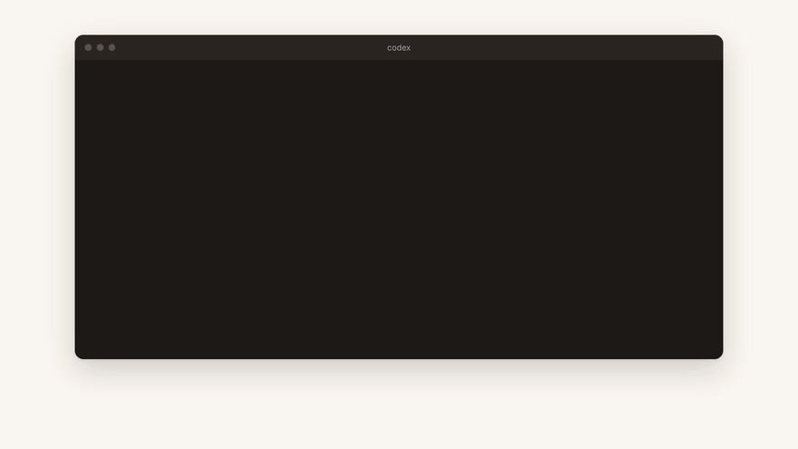
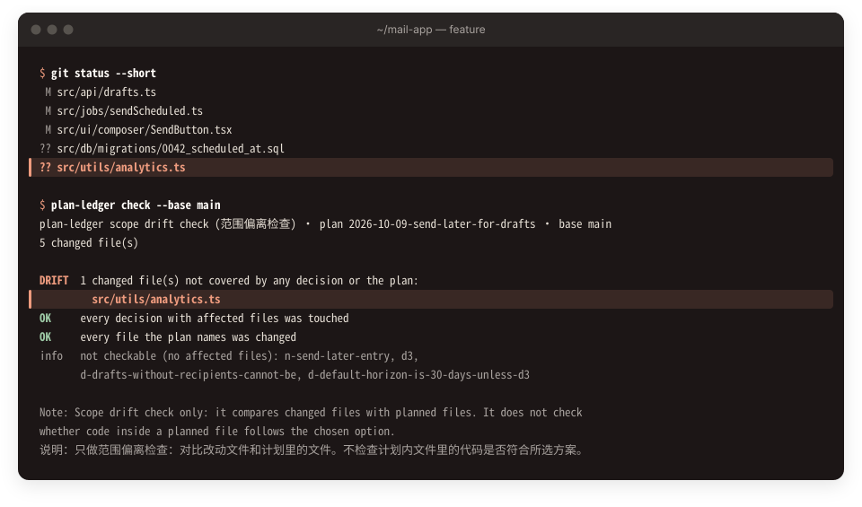
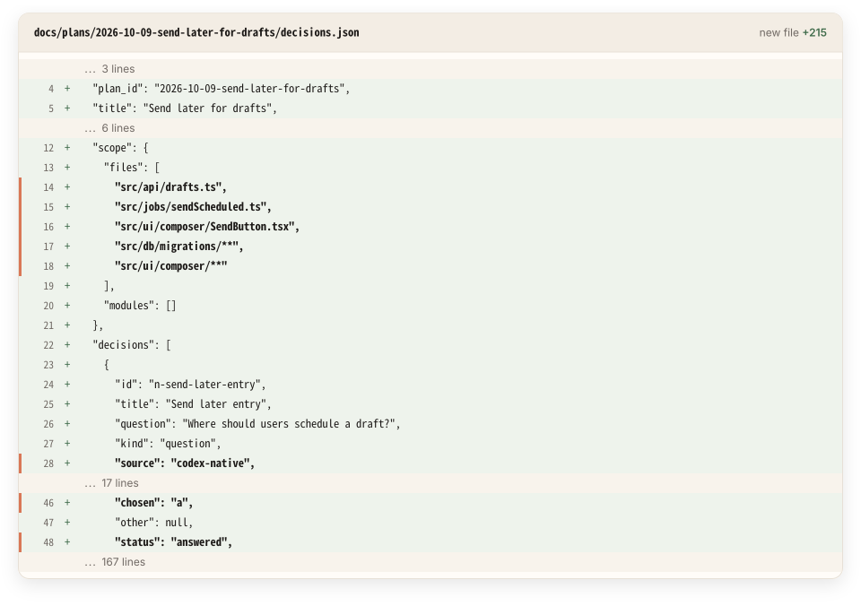
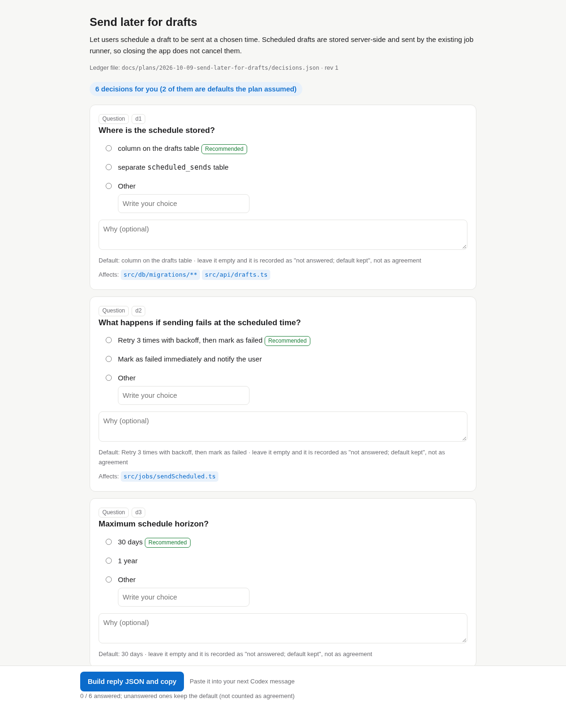

[中文](./README.md) · **English**

#  codex-plan-ledger

**A decision ledger for Codex `/plan`.** Codex agreed to a plan with you. After coding, one command shows whether the change touched files outside that plan, and every decision is in the PR as a diff.

**Why you'd want this**

1. When you let Codex plan and then code, it can quietly edit files you never agreed on.
2. plan-ledger writes down what you agreed (`decisions.json`, in your repo) when the plan is made.
3. After coding, it checks the changed files against that record and tells you what fell outside it. It compares file lists; it does not read the code.

[](./docs/assets/intro-en.mp4)

<sub>10-second intro ([MP4](./docs/assets/intro-en.mp4)). The hook and check output is real, from running the tool on the repo's fixtures. The Codex pane is redrawn from the fixture transcript, and the code edits are written by a script.</sub>

## How it works

[](./docs/assets/how-it-works-en.png)

<sub>Read top to bottom: solid arrows are calls or writes, dashed arrows are replies, orange is what plan-ledger does. Source: [`diagrams/how-it-works-en.html`](./diagrams/how-it-works-en.html) (generated by `npm run diagrams`, drawn in the [sketchboard-diagram](https://github.com/miniLV/sketchboard-diagram) style).</sub>

- **Scope drift check.** `plan-ledger check` lists changed files the plan never named, and planned files nobody touched. In 3 runs with planted drift: unplanned file caught 3/3, untouched planned files caught 3/3, no false alarm on a clean tree 3/3.
- **Decisions in the PR.** The questions Codex asked you, the plan's open choices and its stated defaults are written to `decisions.json`, so the reviewer sees what was chosen and why.
- **Stays out of the way.** Runs as a Codex `Stop` hook: no extra model calls, no network, never waits.

```sh
npm i -g github:miniLV/codex-plan-ledger && plan-ledger init --write
```

[Homepage](https://minilv.github.io/codex-plan-ledger/) · [Skill](./skills/plan-ledger/SKILL.md) · [Schema](./schema/decisions.schema.json) · [Measurement plan](./docs/measurement-plan.md) · Codex CLI · Node.js 20+ · zero dependencies · MIT



<sub>Real `plan-ledger check` output, run on a scratch repo built from the repo's fixtures (path shown as `~/mail-app`).</sub>



<sub>The `decisions.json` that `plan-ledger hook-stop` wrote in the same run (excerpt; folded lines are marked).</sub>

> **Status: early prototype, v0.1.** Across 3 measured pairs, rounds did not improve (2 losses, 1 tie), so it does not aim to cut rounds. The check reads file lists, not code: contradictions of a decision inside a planned file were caught 0/3. See [Measured](#measured-two-rounds-directional-n--3-pairs).

## What it is

Keep using Codex's native Plan mode and answer its questions in Codex. When the plan arrives, the `Stop` hook reads those Q&A from the session, writes them with the plan's open items and stated defaults to `docs/plans/<id>/decisions.json`, and renders one offline HTML page for review. The ledger ships in the same PR as the code; after implementation, run `plan-ledger check`.

| Part | What it does |
| --- | --- |
| `plan-ledger hook-stop` | Codex `Stop` hook. Takes the `<proposed_plan>` from `last_assistant_message` (or, when it is not there, from the session transcript at `transcript_path`; see "Findings" below). When a transcript is available it also reads the questions Codex asked with `request_user_input` and your replies. It renders one HTML page from plain templates, writes `decisions.json` and `plan.md`, prints the HTML path, and lets the turn end normally. **It never blocks and never waits for you.** |
| Decision page `plan.html` | One offline file with no external resources. A summary row (how many decisions still need you, how many were answered in Codex, how many are plan defaults), one card per decision with its options, the plan's recommendation and the affected files; answered items and defaults can be changed too. A "Build reply JSON and copy" button with the hint "Paste it into your next Codex message". The page UI defaults to Chinese; set `PLAN_LEDGER_LANG=en` or pass `--lang en`. |
| Decision ledger `decisions.json` | Versioned JSON (`schema_version`) with a [JSON Schema](schema/decisions.schema.json) and a validator. It ships in the same PR as the code, so reviewers see what was chosen and why. |
| `plan-ledger check` | Scope drift check: compares `git diff` with each decision's `affected` files. Reports changed files outside the plan, and decisions whose files were never touched. |
| `plan-ledger hook-prompt` | Optional `UserPromptSubmit` hook (experimental). `ledger:apply` injects the latest decisions into context; a pasted reply JSON is recorded in the ledger. |
| `skills/plan-ledger` | Manual fallback when hooks are not installed or not trusted: give the plan to the skill and it runs the same renderer. |

## Step by step

1. Run `/plan` as usual and answer Codex's own questions. When a `<proposed_plan>` appears, the Stop hook only parses, renders, and writes the ledger, then ends the turn. It never blocks and never waits. Questions Codex asked are recorded as `source: "codex-native"`, answered, and are not asked again.
2. Open `plan.html` to review. Answer remaining open items in one pass. Stated defaults are reviewable and do not count as open. Unanswered items are stored as "not answered; default kept", not as agreement.
3. Use "Build reply JSON and copy", then paste into your next Codex message. Optional `hook-prompt` records answers into the ledger; without it, run `plan-ledger answer`.
4. After coding, run `plan-ledger check --base main`.

Rendering never calls a model. If `<proposed_plan>` parsing fails, the turn is left alone (exit 0).

<details>
<summary>Decision page screenshot</summary>



Headless Chrome; synthetic fixture from the repo. Or try the [live demo](https://minilv.github.io/codex-plan-ledger/#demo).
</details>

## Install

```sh
npm i -g github:miniLV/codex-plan-ledger
plan-ledger init            # preview which files would be written
plan-ledger init --write    # writes <repo>/.codex/hooks.json and .agents/skills/plan-ledger/
# or: plan-ledger init --user --write  → ~/.codex/hooks.json and ~/.agents/skills/
```

Then start Codex, open `/hooks`, review and trust the two hooks. Codex records trust against each hook definition's hash; untrusted hooks do not run. Trust is given interactively in `/hooks` (it writes `hooks.state.<key>.trusted_hash` to your config). The only non-interactive options are `codex exec --dangerously-bypass-hook-trust` or the thread config `bypass_hook_trust: true`; both run **every** untrusted hook, so use them only in a throwaway test setup.

Or configure it by hand in `<repo>/.codex/hooks.json` or `~/.codex/hooks.json`:

```json
{
  "hooks": {
    "Stop": [
      { "hooks": [{ "type": "command", "command": "plan-ledger hook-stop", "timeout": 30 }] }
    ],
    "UserPromptSubmit": [
      { "hooks": [{ "type": "command", "command": "plan-ledger hook-prompt", "timeout": 10 }] }
    ]
  }
}
```

The same config as inline `config.toml` is in [`examples/codex/config.toml`](examples/codex/config.toml). These formats were checked against the official Codex [hooks docs](https://developers.openai.com/codex/hooks) and the generated hook schemas in `openai/codex` (2026-10-09, `rust-v0.162.0`):

- `Stop` input includes `last_assistant_message`. On exit 0, stdout must be JSON or empty. We only return `systemMessage` and never `decision: "block"`, so Codex is never asked to continue.
- `UserPromptSubmit` input includes `prompt`. `hookSpecificOutput.additionalContext` is added as developer context.
- A project's `.codex/` layer loads only when the project is trusted. Hooks are on by default; turn them off with `[features] hooks = false`.
- Repo skills live in `.agents/skills/`, user skills in `~/.agents/skills/`.

Optional: add [`examples/codex/AGENTS.md.snippet`](examples/codex/AGENTS.md.snippet) to your `AGENTS.md` so Codex gives a complete `<proposed_plan>` on the first turn (not a draft or a list of questions) and lists open choices in a `## Decisions` section with options, `(Recommended)` and `Affects:`. Parsing gets more precise and the scope drift check has more to work with.

## Usage

```sh
# What the hook does, by hand (the fallback skill uses this)
plan-ledger render plan.md            # also accepts a full message with <proposed_plan>, or - for stdin
plan-ledger render plan.md --no-ledger --open   # HTML only, nothing written to the repo

# Record answers (the text or JSON the page copies)
pbpaste | plan-ledger answer -

# In Codex: send ledger:apply (or ledger:apply <plan-id>) to inject the decisions
#  `/ledger apply` is accepted too, but the Codex TUI may treat it as an unknown slash command; prefer ledger:apply

# After implementation
plan-ledger check --base main               # readable report
plan-ledger check --base main --json        # machine-readable
plan-ledger check --base main --strict      # exit 1 on drift, for CI or pre-commit

plan-ledger validate                        # validate every ledger under docs/plans/
```

`plan.html` is a view you can regenerate at any time, so you may add `docs/plans/*/plan.html` to `.gitignore`. Commit `decisions.json` and `plan.md`.

## Ledger schema

```jsonc
{
  "$schema": "https://raw.githubusercontent.com/miniLV/codex-plan-ledger/main/schema/decisions.schema.json",
  "schema_version": 1,
  "plan_id": "2026-10-09-send-later-for-drafts",
  "title": "Send later for drafts",
  "source": "codex-plan-mode",          // or "manual"
  "created_at": "2026-10-09T12:00:00.000Z",
  "updated_at": "2026-10-09T12:05:00.000Z",
  "revision": 1,                        // +1 per plan revision; answered decisions are kept
  "plan_sha256": "…",                   // hash of the plan text in plan.md
  "summary": "…",
  "scope": { "files": ["src/api/drafts.ts"], "modules": [] },   // every file the plan mentions
  "decisions": [
    {
      "id": "d2",
      "title": "What happens if sending fails at the scheduled time?",
      "question": "What happens if sending fails at the scheduled time?",
      "kind": "question",               // question | options | tbd | decision | assumption
      // "source": "codex-native"       // asked by Codex and answered in Codex; absent = from the plan text
      "options": [
        { "id": "a", "label": "Retry 3 times with backoff, then mark as failed", "recommended": true },
        { "id": "b", "label": "Mark as failed immediately and notify the user", "recommended": false }
      ],
      "default": "a",
      "chosen": "b",                    // option id, "other", or null
      "other": null,                    // text when chosen is "other"
      "status": "answered",             // answered | default (= not answered; default kept, not agreement)
      "affected": { "files": ["src/jobs/sendScheduled.ts"], "modules": [] },
      "rationale": "Users must know right away; silent retries hide outages."
    }
  ]
}
```

Decision points are found heuristically: `## Decisions` / `## 待决`-style sections, items ending in a question mark, `Option A/B`, `方案 A/B`, `TBD`, `choose`, `待定` and similar. Defaults under `## Assumptions`, `Chosen defaults` and similar headings are recorded as `kind: assumption`, `status: default`: shown on the page to review and edit, but not counted as decisions that need you. Decision ids come from the title and stay stable across plan revisions; `D1:` becomes `d1`. Answers are stored as data and never executed.

When Codex revises the plan, earlier answers are carried forward to decisions with the same id, or else the same title, as long as the chosen option is still offered (matched by id with the same label, or by label). Carried answers get a `carried` field (`from_revision`, `match: id|title`, `previous_id`) and a "carried from rev N" tag on the page; answering again removes it. Answers whose decision or option is gone are kept in `earlier_answers` instead of being dropped.

## Scope drift check

`plan-ledger check --base <ref>` takes the changes from `<ref>` to the working tree (untracked files included, `docs/plans/` excluded) and compares them with the ledger:

| Report field | Meaning | `--strict` |
| --- | --- | --- |
| `files_outside_plan` | Changed, but not in any decision's `affected` and not mentioned in the plan | drift |
| `decisions_not_touched` | A decision (including answers kept in `earlier_answers`) lists `affected` files, and none of them changed | drift |
| `planned_files_not_touched` | A concrete file the plan text says it changes (lines like "do not modify X" excluded), not tied to any decision, and not changed | drift |
| `files_in_plan_scope_without_decision` | Mentioned in the plan, not tied to a decision | info |
| `decisions_without_affected` | The decision lists no files, so it cannot be checked | info |

If the repo root has an `INTENT.md` from [intent-tests](https://github.com/miniLV/intent-tests), its `## Scope` also counts as planned (use `--intent <file>` for another path).

**Known limit: it only checks which files changed; it does not read code.** Unplanned edits and untouched planned files are caught. Code inside a planned file that contradicts a chosen decision (for example, the decision says "no retry" and the code still retries) is **not** caught. That is why it is called a scope drift check, not a decision-compliance check. Checking code against decision content is the next step; see the [measurement plan](docs/measurement-plan.md).

## What works / what is experimental

| | Status |
| --- | --- |
| Parsing, rendering, ledger, `render` / `answer` / `validate` / `check` | Works, covered by tests (`npm test`, offline) |
| `Stop` hook stdin/stdout contract | Run in a live Codex session (codex-cli 0.156.0, Plan mode; see "Findings"); covered by tests |
| `UserPromptSubmit` hook (`ledger:apply`, recording answers) | Experimental |
| Reading Codex's native Q&A (`request_user_input`) from the transcript | Experimental. The transcript format is not a public contract; parsing follows what codex-cli 0.156.0 actually wrote, tested on excerpts from real sessions, and checked once end to end with the real hook in a live Plan-mode session (see "Findings"). If it cannot be read, it is skipped and nothing else is affected |
| Decision detection | Heuristic. Tests use 3 hand-written synthetic plans and 2 plans captured from a real Codex session (`test/fixtures/real/`). In the real session the model did not use the requested option format; see "Findings" |
| Windows | Untested |

## Measured (two rounds, directional, n = 3 pairs)

**This is not evidence of an effect.** Each pair is one native Plan run and one plan-ledger run on the same task, same model (`codex/gpt-6.1-sol`, medium) and settings; questions were answered by a script reading a hidden `oracle.json`, with the same rules in both arms. Tasks are on vercel/ms@2.1.3. Round 2 used a leaner profile for both arms, so tokens are not comparable across rounds.

| Round / task | Rounds until final (native / plan-ledger) | Planning tokens in / cached / out / reasoning (native → plan-ledger) | Total tokens (native / plan-ledger) | Verify |
| --- | --- | --- | --- | --- |
| 1 / strict-option | 1 / 2 | 294,933 / 236,416 / 941 / 65 → 372,651 / 307,456 / 1,632 / 119 | 717,487 / 586,971 | both pass |
| 2 / strict-option | 1 / 2 | 65,931 / 49,792 / 865 / 61 → 83,141 / 55,424 / 1,284 / 134 | 180,208 / 205,644 | both pass |
| 2 / month-unit | 1 / 1 | 79,553 / 48,256 / 853 / 0 → 66,354 / 50,048 / 781 / 59 | 179,053 / 140,020 | both pass |

**Result:** plan-ledger did not win on rounds in any pair (2 losses, 1 tie). Total tokens went both ways. The idea of replacing native questions with one HTML pass is not supported by this data; the project is positioned as a decision ledger plus a scope drift check.

Scope drift check on the 3 plan-ledger runs (planted after implementation): clean tree 3/3 no false positive; unplanned new file 3/3 caught; planned files reverted 3/3 caught; contradicting code inside a planned file 0/3 caught, matching the known limit. During the round-2 strict-option run, `options.strict` in the plan text was taken for a file name and caused one false positive; that is fixed and recomputed, and the original output is kept in the data.

Since these two rounds (not re-run yet): Codex's own questions and answers go straight into the ledger; stated plan defaults no longer count as open; and the scripted answerer's matching had a defect fixed (it accepted "Change only `index.js`, `tests.js`, and `readme.md`" as fitting the intent "do not change test files"). See [bench/README.md](bench/README.md#changes-after-round-2-no-new-runs-yet).

Raw data: [round 1](bench/results/2026-10-09-round1/summary.md) · [round 2](bench/results/2026-10-09-round2/summary.md)

<details>
<summary>Findings (behaviour observed in live Codex sessions)</summary>

- In codex-cli 0.156.0 Plan mode the `Stop` hook fires, but the plan arrives as a separate `plan` item and the payload's `last_assistant_message` is an empty string. The session transcript (`transcript_path`) still has the raw message with the `<proposed_plan>` tags, so `hook-stop` now falls back to it; with that, the real hook wrote the ledger and the page. Ephemeral sessions have no `transcript_path`, and then the hook cannot see the plan.
- Live check of native Q&A capture (2026-10-09, one Plan-mode session, about 43k tokens): Codex asked 2 questions with `request_user_input`; the real `Stop` hook read the Q&A from the transcript and wrote both to `decisions.json` as `source: "codex-native"`, answered; hook output `nothing to answer; 2 answered in Codex`. The prompt explicitly asked Codex to ask first; this is a functional check, not a measurement. See [bench/results/2026-10-09-live-native](bench/results/2026-10-09-live-native/README.md).
- The payload's `permission_mode` was `bypassPermissions`, not `plan`; plan-ledger does not rely on it.
- Round 2: in both plan-ledger runs the real `Stop` hook wrote the ledger (through the transcript fallback), and the `UserPromptSubmit` hook recorded the answers.
- The model did not write decisions in the requested "options + recommendation + Affects" format. It wrote `**D1 resolved:** …` items, and after the answers a `## Recorded Decisions` section. The parser used in this round treated those as open decisions; it now skips resolved items and such sections, with tests on the captured plans.

</details>

## Status

Early prototype v0.1. Only the directional runs above. It does not aim to save rounds. Next steps: [measurement plan](docs/measurement-plan.md).

## Development

```sh
npm test              # node --test, zero dependencies
npm run figures       # regenerate docs/assets/*.svg (real run on fixtures; deterministic; tests compare them)
npm run demo          # regenerate the landing-page demo pages
npm run screens       # docs/assets/decision-page-*.png (headless Chrome)
npm run intro:video   # regenerate docs/assets/intro-*.{mp4,gif} (10-second intro; needs headless Chrome and ffmpeg)
npm run demo:video    # regenerate docs/assets/demo-flow-*.{gif,mp4} (needs headless Chrome and ffmpeg)
npm run diagrams      # diagrams/how-it-works-*.html and docs/assets/how-it-works-*.png (sequence diagram; headless Chrome)
npm run icon          # icon, favicon and docs/assets/social-preview.png (headless Chrome and ffmpeg)
```

## Thanks

Inspired in part by community work that renders plans as HTML ([html-plan](https://github.com/anthropics/claude-plugins-community/tree/main/html-plan), [answer-me-with-html](https://github.com/QingYunA/answer-me-with-html)); no code was copied.

## License

[MIT](LICENSE)
