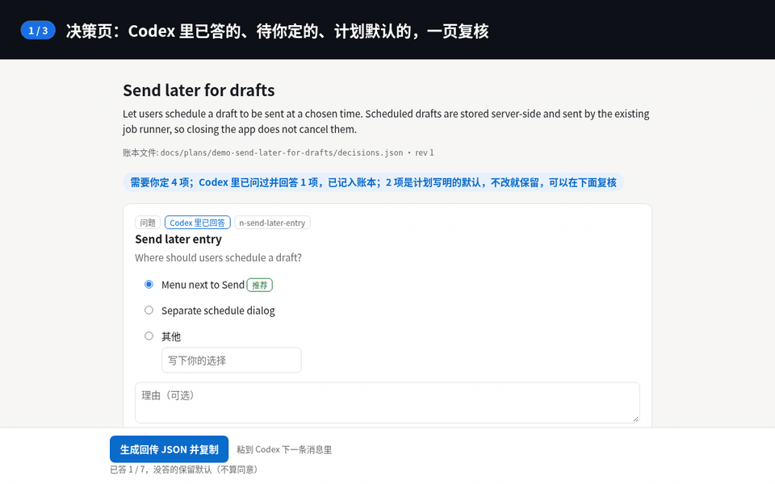
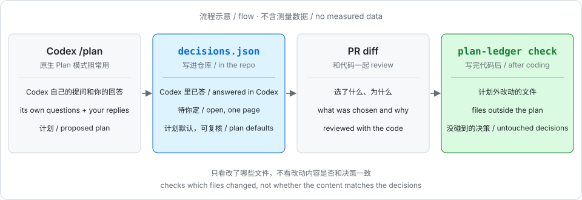
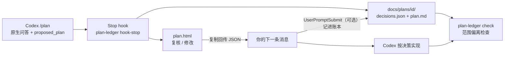

<h1 align="center">codex-plan-ledger</h1>

<p align="center">
  <strong>Codex <code>/plan</code> 的决策账本：Codex 问过你的、计划里待定的、计划默认的，都写进仓库里的 <code>decisions.json</code>，能 diff、能 review；代码写完，再查一遍有没有超出计划范围。</strong>
</p>

<p align="center">
  Codex 原生 Plan 模式照常用，Codex 自己的提问也照常在 Codex 里回答。计划一出来，<code>Stop</code> hook 从会话记录里读出这些问答，连同计划里还待定的决策和写明的默认，一起写进 <code>docs/plans/&lt;id&gt;/decisions.json</code>，再生成一页离线 HTML 供复核和修改。这份账本和代码放在同一个 PR 里 review；代码写完，<code>plan-ledger check</code> 对照改动文件和计划范围。
</p>

<p align="center">
  <a href="https://minilv.github.io/codex-plan-ledger/?lang=zh"><strong>主页 + 在线演示</strong></a> ·
  <a href="./skills/plan-ledger/SKILL.md">Skill</a> ·
  <a href="./schema/decisions.schema.json">Schema</a> ·
  <a href="./docs/measurement-plan.md">实测计划</a> ·
  <strong>简体中文</strong> · <a href="./README.en.md">English</a>
</p>

<p align="center">
  
  <br><sub>决策页 → PR 里的 <code>decisions.json</code> diff → <code>plan-ledger check</code>。合成示例，由 <code>scripts/gen-demo-video.mjs</code> 用无头 Chrome + ffmpeg 生成（<a href="./docs/assets/demo-flow-zh.mp4">MP4</a>）。</sub>
</p>

<p align="center">
  
  <br><sub>故事向短片（痛点 → 改一项 → PR diff → check → 诚实边界）。合成示例，由 <code>scripts/gen-story-video.mjs</code> 生成（<a href="./docs/assets/story-zh.mp4">MP4</a>）。</sub>
</p>

<p align="center">
  <code>npm i -g github:miniLV/codex-plan-ledger && plan-ledger init --write</code>
</p>

<p align="center">
  Codex CLI · Node.js 20+ · 零依赖 · 不额外调用模型 · MIT
</p>

<p align="center">
  
</p>

> **实测一句话：** 在 n = 3 对里，轮数没有改善；范围偏离（计划外的文件、该改没改的文件）3/3 抓到，文件内和决策相反的改动 0/3 抓到。详见 [实测](#实测两轮方向性共-n--3-对)。
>
> **状态：早期原型 v0.1。** 功能能用、有测试覆盖。它不替代 Codex 的原生提问，也不承诺减少来回轮数；它做的是把决策留成记录，并在写完代码后查范围。上面的图是流程示意，不是测量结果。

<p align="center">
  
  <br><sub>决策页截图（无头 Chrome 截取）。页面内容来自合成样例 <code>test/fixtures/send-later.message.md</code>，外加一个合成的“已在 Codex 里回答”的问题。</sub>
</p>

## 它是什么

| 部分 | 作用 |
| --- | --- |
| `plan-ledger hook-stop` | Codex `Stop` hook。从 `last_assistant_message` 里取出 `<proposed_plan>`（取不到时读 `transcript_path` 指向的会话记录，见下文“实测发现”）；有会话记录时，还会读出 Codex 用 `request_user_input` 问过的问题和你的回答。然后用纯模板渲染成一页 HTML，写 `decisions.json` 和 `plan.md`，打印 HTML 路径，正常结束这一轮。**从不阻塞、从不等你。** |
| 决策页 `plan.html` | 单文件、离线、没有外部资源。顶部写还需要你定几项、几项已在 Codex 里答过、几项是计划写明的默认；每项一张卡片：选项、计划里的推荐、影响的文件，已答的和默认的也能改。底部按钮“生成回传 JSON 并复制”，提示“粘到 Codex 下一条消息里”。页面默认中文，英文用 `PLAN_LEDGER_LANG=en` 或 `--lang en`。 |
| 决策账本 `decisions.json` | 带 `schema_version` 的 JSON，附 [JSON Schema](schema/decisions.schema.json) 和校验命令。和代码放在同一个 PR 里，评审人能看到当初选了什么、为什么。 |
| `plan-ledger check` | 范围偏离检查：对比 `git diff` 和每项决策的 `affected` 文件，报出计划外被改的文件，以及计划里该改却没碰的决策。 |
| `plan-ledger hook-prompt` | 可选的 `UserPromptSubmit` hook（实验性）。发 `ledger:apply` 就把最新决策注入上下文；粘贴的回传 JSON 会自动记进账本。 |
| `skills/plan-ledger` | hook 没装或不被信任时的手动兜底：把计划贴给 skill，它调用同一个渲染器。 |

<p align="center">
  
</p>

## 工作流程



1. 在 Codex 里照常 `/plan`，Codex 问问题就照常在 Codex 里答。Codex 给出 `<proposed_plan>` 时，`Stop` hook 只做三件事：解析、渲染、写账本。Codex 问过的问题和你的回答记为 `source: "codex-native"`、已作答，不会再问一遍。终端会出现一行，例如 `plan-ledger: nothing to answer; 1 answered in Codex; 4 plan default(s) kept, reviewable → file://…/plan.html`。
2. 打开这页复核。还需要你定的项一次答完；计划写明的默认（“Chosen defaults”“Assumptions”）记为 `status: default`，不算待答，想改也能改。不选的项记为“未作答，保留默认”，**不算同意**。
3. 点“生成回传 JSON 并复制”，粘到 Codex 的下一条消息里。装了 `hook-prompt` 的话，这些答案会同时写进 `decisions.json`；没装就跑 `plan-ledger answer`。
4. 代码写完，跑 `plan-ledger check --base main`。

渲染全程不调用模型。解析失败时（`<proposed_plan>` 不是公开约定，格式可能变），原文原样放行，Codex 这一轮不受影响，只多一条提示。

## 安装

```sh
npm i -g github:miniLV/codex-plan-ledger
plan-ledger init            # 预览：要写哪些文件、写什么
plan-ledger init --write    # 写入 <repo>/.codex/hooks.json 和 .agents/skills/plan-ledger/
# 或者 plan-ledger init --user --write  → ~/.codex/hooks.json 和 ~/.agents/skills/
```

然后启动 Codex，打开 `/hooks`，审核并信任这两个 hook。Codex 会按 hook 定义的 hash 记录信任；没信任之前 hook 不会运行。信任只能在 `/hooks` 里交互完成（它写的是配置里的 `hooks.state.<key>.trusted_hash`）；非交互的跑法只有 `codex exec --dangerously-bypass-hook-trust` 或线程配置 `bypass_hook_trust: true`，它们会让**所有**未信任的 hook 都运行，只适合一次性的测试环境。

手动配置也行。`<repo>/.codex/hooks.json` 或 `~/.codex/hooks.json`：

```json
{
  "hooks": {
    "Stop": [
      { "hooks": [{ "type": "command", "command": "plan-ledger hook-stop", "timeout": 30 }] }
    ],
    "UserPromptSubmit": [
      { "hooks": [{ "type": "command", "command": "plan-ledger hook-prompt", "timeout": 10 }] }
    ]
  }
}
```

同一套配置写在 `config.toml` 里的版本见 [`examples/codex/config.toml`](examples/codex/config.toml)。这些格式核对自 Codex 官方 [hooks 文档](https://developers.openai.com/codex/hooks) 和 `openai/codex` 仓库里生成的 hook schema（2026-10-09，`rust-v0.162.0`）：

- `Stop` 的输入带 `last_assistant_message`；exit 0 时 stdout 必须是 JSON 或空。我们只返回 `systemMessage`，从不返回 `decision: "block"`，所以不会让 Codex 续跑。
- `UserPromptSubmit` 的输入带 `prompt`；`hookSpecificOutput.additionalContext` 会作为开发者上下文加进去。
- 项目级 `.codex/` 只有在项目被信任时才加载。hooks 默认开启，可用 `[features] hooks = false` 关闭。
- 仓库级 skill 放在 `.agents/skills/`，用户级放在 `~/.agents/skills/`。

可选：把 [`examples/codex/AGENTS.md.snippet`](examples/codex/AGENTS.md.snippet) 加进你的 `AGENTS.md`，让 Codex 在第一轮就给出完整的 `<proposed_plan>`（不停在草稿或一串问题上），并把还没定的选择写进 `## Decisions` 段，每项带选项、`(Recommended)` 和 `Affects:`。解析会更准，范围偏离检查也有据可查。

## 用法

```sh
# hook 自动做的事，也能手动做（skill 兜底用的就是这个）
plan-ledger render plan.md            # 也接受带 <proposed_plan> 的整段消息，或用 - 读 stdin
plan-ledger render plan.md --no-ledger --open   # 只出 HTML，不写仓库

# 记录答案（页面复制出来的那段文字或 JSON）
pbpaste | plan-ledger answer -

# 在 Codex 里：发 ledger:apply（或 ledger:apply <plan-id>）把决策注入上下文
#  `/ledger apply` 也认，但 Codex TUI 可能把它当成未知斜杠命令拦下，建议用 ledger:apply

# 写完代码
plan-ledger check --base main               # 可读报告
plan-ledger check --base main --json        # 机器可读
plan-ledger check --base main --strict      # 有偏离时 exit 1，适合 CI / pre-commit

plan-ledger validate                        # 校验 docs/plans/ 下所有账本
```

`plan.html` 是能随时重新生成的视图，可以放进 `.gitignore`（`docs/plans/*/plan.html`）；`decisions.json` 和 `plan.md` 建议提交。

## 账本格式

```jsonc
{
  "$schema": "https://raw.githubusercontent.com/miniLV/codex-plan-ledger/main/schema/decisions.schema.json",
  "schema_version": 1,
  "plan_id": "2026-10-09-send-later-for-drafts",
  "title": "Send later for drafts",
  "source": "codex-plan-mode",          // 或 "manual"
  "created_at": "2026-10-09T12:00:00.000Z",
  "updated_at": "2026-10-09T12:05:00.000Z",
  "revision": 1,                        // 计划每改一版 +1，已作答的决策会保留
  "plan_sha256": "…",                   // plan.md 原文的 hash
  "summary": "…",
  "scope": { "files": ["src/api/drafts.ts"], "modules": [] },   // 计划正文里提到的所有文件
  "decisions": [
    {
      "id": "d2",
      "title": "What happens if sending fails at the scheduled time?",
      "question": "What happens if sending fails at the scheduled time?",
      "kind": "question",               // question | options | tbd | decision | assumption
      // "source": "codex-native"       // Codex 自己问过、你在 Codex 里答过的问题；没有这个字段 = 来自计划正文
      "options": [
        { "id": "a", "label": "Retry 3 times with backoff, then mark as failed", "recommended": true },
        { "id": "b", "label": "Mark as failed immediately and notify the user", "recommended": false }
      ],
      "default": "a",
      "chosen": "b",                    // 选项 id、"other" 或 null
      "other": null,                    // chosen 为 "other" 时的文字
      "status": "answered",             // answered | default（= 未作答，保留默认，不算同意）
      "affected": { "files": ["src/jobs/sendScheduled.ts"], "modules": [] },
      "rationale": "Users must know right away; silent retries hide outages."
    }
  ]
}
```

决策点是启发式识别的：`## Decisions` / `## 待决` 这类段落、以问号结尾的条目、`Option A/B`、`方案 A/B`、`TBD`、`choose`、`待定` 等，`## Assumptions`、`Chosen defaults` 这类段落里的默认记为 `kind: assumption`、`status: default`：列在页面上可以复核和修改，但不算“需要你定”的项。决策 id 由标题生成，计划改版时保持稳定；写成 `D1:` 时直接用 `d1`。答案只当数据存，不会被执行。

Codex 改版计划时，之前的回答会沿用到 id 相同（或者标题相同）的决策上，前提是原来选的选项还在（id 相同且文字相同，或按文字匹配）。沿用的回答带 `carried` 字段（`from_revision`、`match: id|title`、`previous_id`），页面上显示“沿用第 N 版的回答”；重新作答后这个标记会去掉。决策或选项在新版里没了的回答，放进 `earlier_answers` 保留，不会丢。

## 范围偏离检查

`plan-ledger check --base <ref>` 拿 `<ref>` 到工作区的改动（含未跟踪文件，不含 `docs/plans/` 本身）去对照：

| 报告项 | 含义 | `--strict` |
| --- | --- | --- |
| `files_outside_plan` | 改了，但不在任何决策的 `affected` 里，也不在计划正文提到的文件里 | 算偏离 |
| `decisions_not_touched` | 决策（包括 `earlier_answers` 里保留的旧回答）列了 `affected` 文件，但一个都没被改 | 算偏离 |
| `planned_files_not_touched` | 计划正文点名要改的具体文件（不算“不要改 X”这类句子），没挂在任何决策上，也没被改 | 算偏离 |
| `files_in_plan_scope_without_decision` | 计划提到了，但没挂在任何决策上 | 仅提示 |
| `decisions_without_affected` | 决策没写影响哪些文件，无法检查 | 仅提示 |

仓库根目录有 [intent-tests](https://github.com/miniLV/intent-tests) 的 `INTENT.md` 时，它的 `## Scope` 也算计划范围（`--intent <file>` 可指定路径）。

**已知局限：它只检查“改了哪些文件”，不读代码内容。** 计划外文件被改、计划内文件没被碰，它能抓到；但如果改动落在计划内的文件里，代码却和某项决策的选择相反（比如选了“不重试”，代码里还在重试），它**抓不到**。所以它叫“范围偏离检查”。按内容核对决策是下一步要做的事，见 [实测计划](docs/measurement-plan.md)。

## 现在能用的 / 实验性的

| | 状态 |
| --- | --- |
| 解析、渲染、写账本、`render` / `answer` / `validate` / `check` | 能用，有测试覆盖（`npm test`，不联网） |
| `Stop` hook 的输入输出约定 | 在真实 Codex 会话里跑通过（codex-cli 0.156.0，Plan 模式，见“实测发现”）；有测试覆盖 |
| `UserPromptSubmit` hook（`ledger:apply`、自动记账） | 实验性 |
| 从会话记录读出 Codex 原生问答（`request_user_input`） | 实验性。会话记录格式不是公开约定；按 codex-cli 0.156.0 实际观察到的格式解析，测试用的是真实会话里截取的片段；在一次真实 Plan 模式会话里由真实 hook 跑通过（见“实测发现”）。读不到时跳过，不影响其他功能 |
| 决策点识别 | 启发式。测试里有 3 份手写的合成计划和 2 份真实 Codex 会话里抓到的计划（`test/fixtures/real/`）。真实会话里模型没按要求的选项格式写决策，见“实测发现” |
| Windows | 没测过 |

## 实测（两轮，方向性，共 n = 3 对）

**这不是效果证据。** 每对是同一任务上原生 Plan 模式和 plan-ledger 各跑 1 次，同一模型（`codex/gpt-6.1-sol`，medium），回答问题的是读隐藏 `oracle.json` 的脚本，两组规则相同。任务在 vercel/ms@2.1.3 上。第 2 轮换了更省的运行配置（两组相同，单次调用的固定输入从约 5.3 万降到约 8.6 千 token），所以**两轮的 token 不能互相比较**，只能在同一轮里比两组。数据：[第 1 轮](bench/results/2026-10-09-round1/summary.md) · [第 2 轮](bench/results/2026-10-09-round2/summary.md)。

| 轮 / 任务 | 定稿前轮数（原生 / plan-ledger） | 计划阶段 token input / cached / output / reasoning（原生 → plan-ledger） | 总 token（原生 / plan-ledger） | 验收 |
| --- | --- | --- | --- | --- |
| 1 / strict-option | 1 / 2 | 294,933 / 236,416 / 941 / 65 → 372,651 / 307,456 / 1,632 / 119 | 717,487 / 586,971 | 都通过 |
| 2 / strict-option | 1 / 2 | 65,931 / 49,792 / 865 / 61 → 83,141 / 55,424 / 1,284 / 134 | 180,208 / 205,644 | 都通过 |
| 2 / month-unit | 1 / 1 | 79,553 / 48,256 / 853 / 0 → 66,354 / 50,048 / 781 / 59 | 179,053 / 140,020 | 都通过 |

**结论（方向性）：在轮数上，plan-ledger 一次都没有赢**（3 对里输 2 次、平 1 次）。总 token 有高有低，没有一致方向。第 2 轮里，即使 AGENTS.md 要求把待定选择写进 `## Decisions`，Codex Plan 模式仍然先用自带的 `request_user_input` 提问，计划里也没有 `## Decisions` 段；strict-option 多出的一轮来自计划末尾的“Chosen defaults”被解析成了待确认项。一页答完替代原生提问这个设想，数据不支持，所以定位改成了决策账本 + 范围偏离检查。

这两轮之后（没有重新跑）：Codex 自己的问答直接记进账本；计划写明的默认不再算待答项；脚本回答方的匹配规则修了一个缺陷（它曾把“只改 `index.js`、`tests.js`、`readme.md`”当成符合“不改测试文件”的意图），见 [bench/README.md](bench/README.md#changes-after-round-2-no-new-runs-yet)。

范围偏离检查（3 次 plan-ledger 运行，实现之后在副本上埋入）：不埋时 3 次都无误报；计划外新文件 3/3 抓到；把决策或计划列出的文件改回原样 3/3 抓到（第 1 轮在原始运行和重放分析里都抓到）；在计划内的 `index.js` 里写与决策相反的代码 0/3 抓到，和已知局限一致。第 2 轮 strict-option 运行时，计划里的 `options.strict` 被误当成文件名，造成过一次误报，已修复并重算，原始输出保留在数据里。

### 实测发现

- 在 codex-cli 0.156.0 的 Plan 模式里，`Stop` hook 会触发，但计划以单独的 `plan` 条目给出，payload 里的 `last_assistant_message` 是空字符串。会话记录（`transcript_path`）里还保留带 `<proposed_plan>` 标签的原文，所以 `hook-stop` 现在会退回去读它；这样真实 hook 写出了账本和页面。临时（ephemeral）会话没有 `transcript_path`，这时 hook 拿不到计划。
- 原生问答记账的实机检查（2026-10-09，一次 Plan 模式会话，约 4.3 万 token）：Codex 用 `request_user_input` 问了 2 个问题，真实 `Stop` hook 从会话记录里读出问答，写进 `decisions.json`，两项都是 `source: "codex-native"`、已作答，hook 输出 `nothing to answer; 2 answered in Codex`。这次提示词明确要求 Codex 先问，这是功能检查，不是测量。见 [bench/results/2026-10-09-live-native](bench/results/2026-10-09-live-native/README.md)。
- payload 里的 `permission_mode` 是 `bypassPermissions` 而不是 `plan`，plan-ledger 不依赖这个字段。
- 第 2 轮：两次 plan-ledger 运行都由真实 `Stop` hook 写出账本（经会话记录回退），`UserPromptSubmit` hook 记下了回答。
- 模型没按 AGENTS.md 要求的“选项 + 推荐 + Affects”格式写决策，而是写成 `**D1 resolved:** …`，答完后又加了 `## Recorded Decisions`。这一轮用的旧解析器把它们当成待答项；之后已改为跳过“已决”条目和这类段落，并用抓到的真实计划加了测试。

## 状态

早期原型 v0.1。只有上面两轮方向性实测（共 n = 3 对），轮数上没有显示出优势，所以 plan-ledger 不以省轮次为目标。它做两件事：决策账本（Codex 的原生问答、计划里的待定项和默认都在里面；可 diff、可 review、跨版本沿用回答）和范围偏离检查（只看文件，不看内容）。按内容核对决策、以及更多任务上的重复实测，见 [docs/measurement-plan.md](docs/measurement-plan.md)。

## 开发

```sh
npm test              # node --test，零依赖
npm run figures       # 重新生成 docs/assets/*.svg（确定性输出，测试会核对）
npm run demo          # 重新生成落地页的在线演示页
npm run demo:video    # 重新生成 docs/assets/demo-flow-*.{gif,mp4}（需要无头 Chrome 和 ffmpeg）
npm run story:video   # 重新生成 docs/assets/story-zh.{gif,mp4}（故事向短片）
```

## 致谢

- 灵感来自 Thariq Shihipar 的 [html-plan](https://github.com/anthropics/claude-plugins-community/tree/main/html-plan)。
- 灵感来自 [QingYunA/answer-me-with-html](https://github.com/QingYunA/answer-me-with-html)。

两者都只借鉴了思路，没有复制代码。

## 许可

[MIT](LICENSE)
