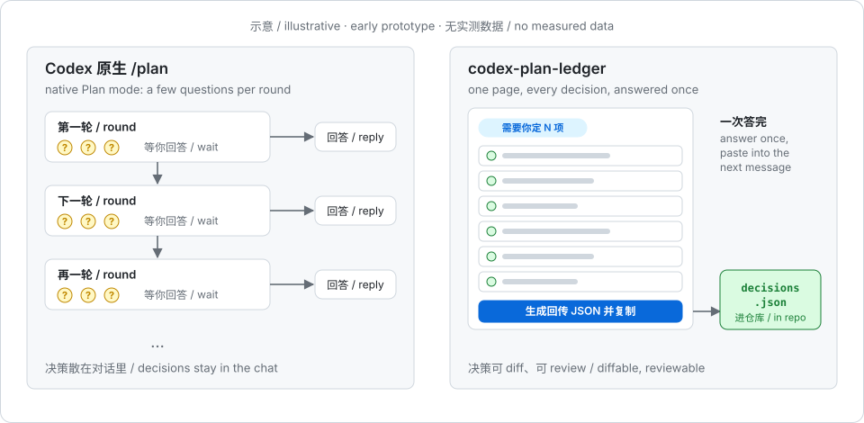
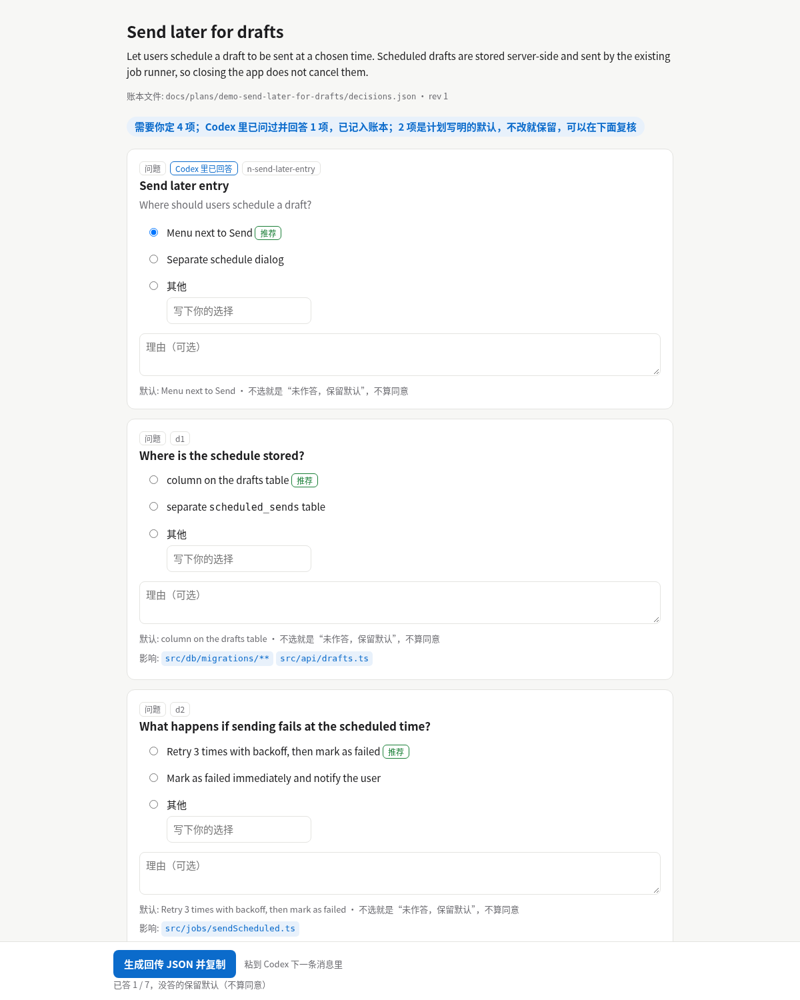
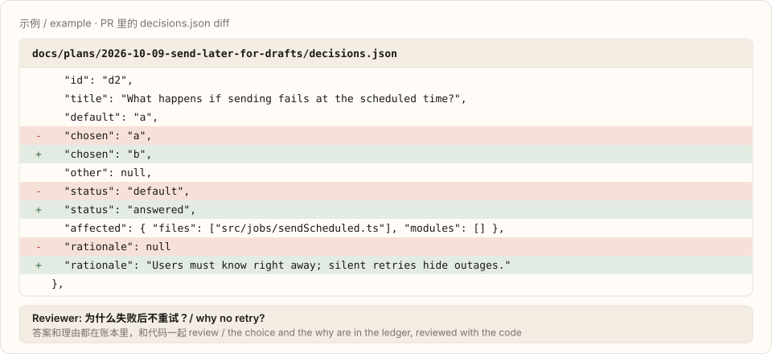
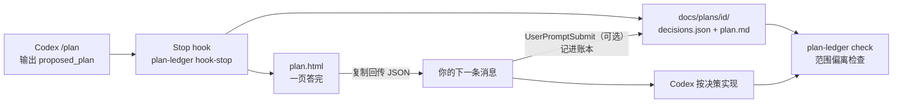

<h1 align="center">codex-plan-ledger</h1>

<p align="center">
  <strong>把 Codex <code>/plan</code> 里的决策一页答完，写进仓库，写完代码再查有没有跑偏。</strong>
</p>

<p align="center">
  Codex 原生 Plan 模式照常用。计划一出来，自动生成一页离线 HTML，所有决策一次答完；答案落进 <code>docs/plans/&lt;id&gt;/decisions.json</code>，能 diff、能在 PR 里 review；代码写完后跑一次范围偏离检查。
</p>

<p align="center">
  <a href="https://minilv.github.io/codex-plan-ledger/?lang=zh"><strong>主页 + 在线演示</strong></a> ·
  <a href="./skills/plan-ledger/SKILL.md">Skill</a> ·
  <a href="./schema/decisions.schema.json">Schema</a> ·
  <a href="./docs/measurement-plan.md">实测计划</a> ·
  <strong>简体中文</strong> · <a href="./README.en.md">English</a>
</p>

<p align="center">
  <code>npm i -g github:miniLV/codex-plan-ledger && plan-ledger init --write</code>
</p>

<p align="center">
  Codex CLI · Node.js 20+ · 零依赖 · 不额外调用模型 · MIT
</p>

<p align="center">
  
</p>

> **状态：早期原型 v0.1。** 功能能用、有测试覆盖。目前只有一轮方向性的实测（1 个任务、每组 1 次，n = 1 对），**不足以说明省了轮次或 token**，见下面的 [实测（第 1 轮）](#实测第-1-轮方向性n--1-对)。上面的图只是示意，不是测量结果。怎么测、什么结果算成立，见 [实测计划](docs/measurement-plan.md)。

<p align="center">
  
  <br><sub>决策页截图（无头 Chrome 截取）。页面内容来自合成样例 <code>test/fixtures/send-later.message.md</code>。</sub>
</p>

## 它是什么

| 部分 | 作用 |
| --- | --- |
| `plan-ledger hook-stop` | Codex `Stop` hook。从 `last_assistant_message` 里取出 `<proposed_plan>`（取不到时读 `transcript_path` 指向的会话记录，见下文“实测发现”），用纯模板渲染成一页 HTML，写 `decisions.json` 和 `plan.md`，打印 HTML 路径，然后正常结束这一轮。**从不阻塞、从不等你。** |
| 决策页 `plan.html` | 单文件、离线、没有外部资源。顶部写“需要你定 N 项”，每项一张卡片：选项、计划里的推荐、影响的文件。底部按钮“生成回传 JSON 并复制”，提示“粘到 Codex 下一条消息里”。页面默认中文，英文用 `PLAN_LEDGER_LANG=en` 或 `--lang en`。 |
| 决策账本 `decisions.json` | 带 `schema_version` 的 JSON，附 [JSON Schema](schema/decisions.schema.json) 和校验命令。和代码放在同一个 PR 里，评审人能看到当初选了什么、为什么。 |
| `plan-ledger check` | 范围偏离检查：对比 `git diff` 和每项决策的 `affected` 文件，报出计划外被改的文件，以及计划里该改却没碰的决策。 |
| `plan-ledger hook-prompt` | 可选的 `UserPromptSubmit` hook（实验性）。发 `ledger:apply` 就把最新决策注入上下文；粘贴的回传 JSON 会自动记进账本。 |
| `skills/plan-ledger` | hook 没装或不被信任时的手动兜底：把计划贴给 skill，它调用同一个渲染器。 |

<p align="center">
  
</p>

## 工作流程



1. 在 Codex 里照常 `/plan`。Codex 给出 `<proposed_plan>` 时，`Stop` hook 只做三件事：解析、渲染、写账本。终端会出现一行 `plan-ledger: N decision(s) to answer → file://…/plan.html`。
2. 打开这页，把所有决策一次答完。不选的项记为“未作答，保留默认”，**不算同意**。
3. 点“生成回传 JSON 并复制”，粘到 Codex 的下一条消息里。装了 `hook-prompt` 的话，这些答案会同时写进 `decisions.json`；没装就跑 `plan-ledger answer`。
4. 代码写完，跑 `plan-ledger check --base main`。

渲染全程不调用模型。解析失败时（`<proposed_plan>` 不是公开约定，格式可能变），原文原样放行，Codex 这一轮不受影响，只多一条提示。

## 安装

```sh
npm i -g github:miniLV/codex-plan-ledger
plan-ledger init            # 预览：要写哪些文件、写什么
plan-ledger init --write    # 写入 <repo>/.codex/hooks.json 和 .agents/skills/plan-ledger/
# 或者 plan-ledger init --user --write  → ~/.codex/hooks.json 和 ~/.agents/skills/
```

然后启动 Codex，打开 `/hooks`，审核并信任这两个 hook。Codex 会按 hook 定义的 hash 记录信任；没信任之前 hook 不会运行。信任只能在 `/hooks` 里交互完成（它写的是配置里的 `hooks.state.<key>.trusted_hash`）；非交互的跑法只有 `codex exec --dangerously-bypass-hook-trust` 或线程配置 `bypass_hook_trust: true`，它们会让**所有**未信任的 hook 都运行，只适合一次性的测试环境。

手动配置也行。`<repo>/.codex/hooks.json` 或 `~/.codex/hooks.json`：

```json
{
  "hooks": {
    "Stop": [
      { "hooks": [{ "type": "command", "command": "plan-ledger hook-stop", "timeout": 30 }] }
    ],
    "UserPromptSubmit": [
      { "hooks": [{ "type": "command", "command": "plan-ledger hook-prompt", "timeout": 10 }] }
    ]
  }
}
```

同一套配置写在 `config.toml` 里的版本见 [`examples/codex/config.toml`](examples/codex/config.toml)。这些格式核对自 Codex 官方 [hooks 文档](https://developers.openai.com/codex/hooks) 和 `openai/codex` 仓库里生成的 hook schema（2026-10-09，`rust-v0.162.0`）：

- `Stop` 的输入带 `last_assistant_message`；exit 0 时 stdout 必须是 JSON 或空。我们只返回 `systemMessage`，从不返回 `decision: "block"`，所以不会让 Codex 续跑。
- `UserPromptSubmit` 的输入带 `prompt`；`hookSpecificOutput.additionalContext` 会作为开发者上下文加进去。
- 项目级 `.codex/` 只有在项目被信任时才加载。hooks 默认开启，可用 `[features] hooks = false` 关闭。
- 仓库级 skill 放在 `.agents/skills/`，用户级放在 `~/.agents/skills/`。

可选：把 [`examples/codex/AGENTS.md.snippet`](examples/codex/AGENTS.md.snippet) 加进你的 `AGENTS.md`，让 Codex 在第一轮就给出完整的 `<proposed_plan>`（不停在草稿或一串问题上），并把还没定的选择写进 `## Decisions` 段，每项带选项、`(Recommended)` 和 `Affects:`。解析会更准，范围偏离检查也有据可查。

## 用法

```sh
# hook 自动做的事，也能手动做（skill 兜底用的就是这个）
plan-ledger render plan.md            # 也接受带 <proposed_plan> 的整段消息，或用 - 读 stdin
plan-ledger render plan.md --no-ledger --open   # 只出 HTML，不写仓库

# 记录答案（页面复制出来的那段文字或 JSON）
pbpaste | plan-ledger answer -

# 在 Codex 里：发 ledger:apply（或 ledger:apply <plan-id>）把决策注入上下文
#  `/ledger apply` 也认，但 Codex TUI 可能把它当成未知斜杠命令拦下，建议用 ledger:apply

# 写完代码
plan-ledger check --base main               # 可读报告
plan-ledger check --base main --json        # 机器可读
plan-ledger check --base main --strict      # 有偏离时 exit 1，适合 CI / pre-commit

plan-ledger validate                        # 校验 docs/plans/ 下所有账本
```

`plan.html` 是能随时重新生成的视图，可以放进 `.gitignore`（`docs/plans/*/plan.html`）；`decisions.json` 和 `plan.md` 建议提交。

## 账本格式

```jsonc
{
  "$schema": "https://raw.githubusercontent.com/miniLV/codex-plan-ledger/main/schema/decisions.schema.json",
  "schema_version": 1,
  "plan_id": "2026-10-09-send-later-for-drafts",
  "title": "Send later for drafts",
  "source": "codex-plan-mode",          // 或 "manual"
  "created_at": "2026-10-09T12:00:00.000Z",
  "updated_at": "2026-10-09T12:05:00.000Z",
  "revision": 1,                        // 计划每改一版 +1，已作答的决策会保留
  "plan_sha256": "…",                   // plan.md 原文的 hash
  "summary": "…",
  "scope": { "files": ["src/api/drafts.ts"], "modules": [] },   // 计划正文里提到的所有文件
  "decisions": [
    {
      "id": "d2",
      "title": "What happens if sending fails at the scheduled time?",
      "question": "What happens if sending fails at the scheduled time?",
      "kind": "question",               // question | options | tbd | decision | assumption
      "options": [
        { "id": "a", "label": "Retry 3 times with backoff, then mark as failed", "recommended": true },
        { "id": "b", "label": "Mark as failed immediately and notify the user", "recommended": false }
      ],
      "default": "a",
      "chosen": "b",                    // 选项 id、"other" 或 null
      "other": null,                    // chosen 为 "other" 时的文字
      "status": "answered",             // answered | default（= 未作答，保留默认，不算同意）
      "affected": { "files": ["src/jobs/sendScheduled.ts"], "modules": [] },
      "rationale": "Users must know right away; silent retries hide outages."
    }
  ]
}
```

决策点是启发式识别的：`## Decisions` / `## 待决` 这类段落、以问号结尾的条目、`Option A/B`、`方案 A/B`、`TBD`、`choose`、`待定` 等，`## Assumptions` 里的默认假设也会列出来让你确认。决策 id 由标题生成，计划改版时保持稳定；写成 `D1:` 时直接用 `d1`。答案只当数据存，不会被执行。

Codex 改版计划时，之前的回答会沿用到 id 相同（或者标题相同）的决策上，前提是原来选的选项还在（id 相同且文字相同，或按文字匹配）。沿用的回答带 `carried` 字段（`from_revision`、`match: id|title`、`previous_id`），页面上显示“沿用第 N 版的回答”；重新作答后这个标记会去掉。决策或选项在新版里没了的回答，放进 `earlier_answers` 保留，不会丢。

## 范围偏离检查

`plan-ledger check --base <ref>` 拿 `<ref>` 到工作区的改动（含未跟踪文件，不含 `docs/plans/` 本身）去对照：

| 报告项 | 含义 | `--strict` |
| --- | --- | --- |
| `files_outside_plan` | 改了，但不在任何决策的 `affected` 里，也不在计划正文提到的文件里 | 算偏离 |
| `decisions_not_touched` | 决策（包括 `earlier_answers` 里保留的旧回答）列了 `affected` 文件，但一个都没被改 | 算偏离 |
| `planned_files_not_touched` | 计划正文点名要改的具体文件（不算“不要改 X”这类句子），没挂在任何决策上，也没被改 | 算偏离 |
| `files_in_plan_scope_without_decision` | 计划提到了，但没挂在任何决策上 | 仅提示 |
| `decisions_without_affected` | 决策没写影响哪些文件，无法检查 | 仅提示 |

仓库根目录有 [intent-tests](https://github.com/miniLV/intent-tests) 的 `INTENT.md` 时，它的 `## Scope` 也算计划范围（`--intent <file>` 可指定路径）。

**已知局限：它只检查“改了哪些文件”，不读代码内容。** 计划外文件被改、计划内文件没被碰，它能抓到；但如果改动落在计划内的文件里，代码却和某项决策的选择相反（比如选了“不重试”，代码里还在重试），它**抓不到**。所以它叫“范围偏离检查”。按内容核对决策是下一步要做的事，见 [实测计划](docs/measurement-plan.md)。

## 现在能用的 / 实验性的

| | 状态 |
| --- | --- |
| 解析、渲染、写账本、`render` / `answer` / `validate` / `check` | 能用，有测试覆盖（`npm test`，不联网） |
| `Stop` hook 的输入输出约定 | 在真实 Codex 会话里跑通过（codex-cli 0.156.0，Plan 模式，见“实测发现”）；有测试覆盖 |
| `UserPromptSubmit` hook（`ledger:apply`、自动记账） | 实验性 |
| 决策点识别 | 启发式。测试里有 3 份手写的合成计划和 2 份真实 Codex 会话里抓到的计划（`test/fixtures/real/`）。真实会话里模型没按要求的选项格式写决策，见“实测发现” |
| Windows | 没测过 |

## 实测（第 1 轮，方向性，n = 1 对）

**这不是效果证据。** 只有 1 个任务（vercel/ms@2.1.3 上加 `strict` 选项），原生 Plan 模式和 plan-ledger 各跑 1 次，同一模型（`codex/gpt-6.1-sol`，medium）、同一套设置。回答问题的是读隐藏 `oracle.json` 的脚本，两组规则相同。原计划 2 个任务，但这一对就用了 130 万 token，第二个任务留到下一轮。完整数据：[bench/results/2026-10-09-round1](bench/results/2026-10-09-round1/summary.md)。

| | 原生 Plan 模式 | plan-ledger |
| --- | --- | --- |
| 计划定稿前的来回轮数 | 1 | 2 |
| 计划阶段 token：input / cached / output / reasoning | 294,933 / 236,416 / 941 / 65 | 372,651 / 307,456 / 1,632 / 119 |
| 含实现的总 token（`totalTokens`） | 717,487 | 586,971 |
| 耗时（计划 / 总计） | 69 s / 151 s | 90 s / 132 s |
| 隐藏验收脚本 | 通过 | 通过 |
| 改到意图范围外的文件 | `tests.js` | 无 |

这一对里，plan-ledger **没有**减少轮数：第一轮模型只给了草稿、没给计划块，多了一次回复。原生组问了 1 个问题，没问到要不要改测试文件，结果改了 `tests.js`；plan-ledger 组的计划把“改哪些文件”列成了一项决策，按 oracle 的回答没有改测试文件。一对数据说明不了规律。

之后修了解析器和账本（跳过“已决”条目、跨版本沿用回答），用新代码离线重放了这一轮记录下来的计划（没有新的 Codex 调用）：最终计划不再误报“3 项待答”，回答保留在账本的 `earlier_answers` 里；但轮数仍是 2 对 1，“把决策影响的文件改回原样”这一项埋入偏离，在范围偏离检查也读 `earlier_answers` 和计划正文里的文件之后，又能抓到了。见 [重放分析](bench/results/2026-10-09-round1/reanalysis.md)。

埋入偏离（plan-ledger 组，实现之后，在副本上跑 `plan-ledger check`）：不埋时无误报；计划外新文件（范围）抓到；把决策影响的文件改回原样（范围）抓到；在计划内的 `index.js` 里写与决策相反的代码（内容）没抓到，和上面写的已知局限一致。

### 实测发现

- 在 codex-cli 0.156.0 的 Plan 模式里，`Stop` hook 会触发，但计划以单独的 `plan` 条目给出，payload 里的 `last_assistant_message` 是空字符串。会话记录（`transcript_path`）里还保留带 `<proposed_plan>` 标签的原文，所以 `hook-stop` 现在会退回去读它；这样真实 hook 写出了账本和页面。临时（ephemeral）会话没有 `transcript_path`，这时 hook 拿不到计划。
- payload 里的 `permission_mode` 是 `bypassPermissions` 而不是 `plan`，plan-ledger 不依赖这个字段。
- 模型没按 AGENTS.md 要求的“选项 + 推荐 + Affects”格式写决策，而是写成 `**D1 resolved:** …`，答完后又加了 `## Recorded Decisions`。这一轮用的旧解析器把它们当成待答项；之后已改为跳过“已决”条目和这类段落，并用抓到的真实计划加了测试。

## 状态

早期原型 v0.1。只有上面这一轮方向性实测（n = 1 对）。要回答“有没有用”，需要按 [docs/measurement-plan.md](docs/measurement-plan.md) 在多个任务上每组至少跑 3 次。

## 开发

```sh
npm test              # node --test，零依赖
npm run figures       # 重新生成 docs/assets/*.svg（确定性输出，测试会核对）
```

## 致谢

- 灵感来自 Thariq Shihipar 的 [html-plan](https://github.com/anthropics/claude-plugins-community/tree/main/html-plan)。
- 灵感来自 [QingYunA/answer-me-with-html](https://github.com/QingYunA/answer-me-with-html)。

两者都只借鉴了思路，没有复制代码。

## 许可

[MIT](LICENSE)
