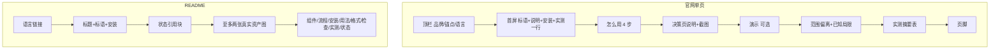
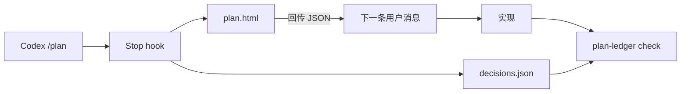

# 线框 · 官网与 README

视觉：象牙底 `#FAF6F1`、正文深棕 `#1C1917`、强调陶土橙 `#D97757`。左对齐文档式，不是居中英雄区。

---

## 1. 官网（`docs/index.html`）文字线框

```text
┌──────────────────────────────────────────────────────────┐
│  codex-plan-ledger     用法   实测   GitHub    中文·EN   │  ← 实色顶栏，无 blur
├──────────────────────────────────────────────────────────┤
│                                                          │
│  早期原型 · v0.1                                         │  ← 小字警示条，非胶囊炫技
│                                                          │
│  Codex /plan 的决策账本                                  │  ← h1 左对齐，28–40px
│                                                          │
│  把 Codex 问过的问题、未定选项和计划默认写入             │
│  decisions.json，可在 PR 里 diff；写完代码后再做         │
│  范围偏离检查。                                          │
│                                                          │
│  实测：n=3，轮数未变少；范围偏离 3/3；文件内矛盾 0/3。   │
│                                                          │
│  ┌─────────────────────────────────────────────┬──────┐  │
│  │ npm i -g github:miniLV/codex-plan-ledger …  │ 复制 │  │
│  └─────────────────────────────────────────────┴──────┘  │
│  [ 看 GitHub ]   打开演示                                 │
│                                                          │
├──────────────────────────────────────────────────────────┤
│  怎么用                                                  │
│  1. Stop hook 写入账本     短说明                         │
│  2. 一页复核               短说明                         │
│  3. 决策进 PR              短说明                         │
│  4. 范围偏离检查           短说明                         │
│                                                          │
│  [ ledger-flow.svg  图注：示意，无测量数据 ]             │
│                                                          │
├──────────────────────────────────────────────────────────┤
│  决策放在一页里复核                                      │
│  ┌────────────────────┐  ┌─────────────────────────────┐ │
│  │ 三句能力说明       │  │ decision-page-*.png         │ │
│  │ · 纯模板           │  │ 图注：合成样例 + 无头 Chrome │ │
│  │ · hook 不等待      │  │                             │ │
│  │ · 改版沿用旧答     │  │                             │ │
│  └────────────────────┘  └─────────────────────────────┘ │
│  （窄屏：图在文下）                                      │
│                                                          │
├──────────────────────────────────────────────────────────┤
│  演示（可选，可折叠）                                    │
│  iframe → demo/plan-zh.html | plan-en.html               │
│  或链到全页；不自动大循环营销视频于首屏                  │
│                                                          │
├──────────────────────────────────────────────────────────┤
│  范围偏离检查                                            │
│  对照 git diff 与 affected …                             │
│  ┌ 已知局限 ─────────────────────────────────────────┐   │
│  │ 只比对文件；计划内文件里与决策相反的代码抓不到。   │   │
│  └───────────────────────────────────────────────────┘   │
│  [ ledger-pr-diff.svg  图注：示例，脚本生成 ]            │
│                                                          │
├──────────────────────────────────────────────────────────┤
│  现状与实测                                              │
│  ┌ 注意 ─────────────────────────────────────────────┐   │
│  │ 方向性 n=3；不是效果证据；轮数一对都没赢。         │   │
│  └───────────────────────────────────────────────────┘   │
│  ┌────────┬──────────┬─────────┬────────┬──────┐         │
│  │轮/任务 │轮数 原/账│input …  │总 token│验收  │         │
│  ├────────┼──────────┼─────────┼────────┼──────┤         │
│  │1/strict│ 1 / 2    │ …       │ …      │都通过│         │
│  │2/strict│ 1 / 2    │ …       │ …      │都通过│         │
│  │2/month │ 1 / 1    │ …       │ …      │都通过│         │
│  └────────┴──────────┴─────────┴────────┴──────┘         │
│  第1轮 · 第2轮 · 实测计划                                │
│                                                          │
├──────────────────────────────────────────────────────────┤
│  github.com/miniLV/codex-plan-ledger · MIT               │
│  Codex CLI · Node 20+ · 零依赖                           │
└──────────────────────────────────────────────────────────┘
```

内容最大宽约 720–800px（表/图可 880px）。区块间距 48–64px。

---

## 2. README 文字线框

```text
[简体中文] · [English]

# codex-plan-ledger

**Codex /plan 的决策账本**
一段说明（左对齐，不要 align=center 多段堆叠）

主页 · Skill · Schema · 实测计划

`npm i -g … && plan-ledger init --write`

Codex CLI · Node 20+ · 零依赖 · MIT

> 实测一句话 + 早期原型状态

[ 可选一张 ] decision-page 截图（宽 ≤720）
[ 可选一张 ] flow 或 pr-diff（不要双 GIF 叠顶）

## 它是什么
| 组件表 |

## 工作流程
mermaid（可保留）+ 4 步列表

## 安装
## 用法
## 账本格式
## 范围偏离检查  + 已知局限
## 现在能用的 / 实验性的
## 实测（全表 + 结论段 + 链到 bench）
## 状态
## 开发
## 致谢（一行）
## 许可
```

---

## 3. 信息流（mermaid）





（流程图与现仓一致；图内不写测量数字。）

---

## 4. 中英切换线框

```text
README:
  [简体中文](README.md) · [English](README.en.md)

官网（推荐静态双页）:
  index.html  ←→  index.en.html
  顶栏右侧：中文 | English

官网（可接受单页）:
  ?lang=zh | ?lang=en  + 少量 JS
  控件同为文字链，强调色仅用于当前项下划线或字重
```

---

## 5. 与旧版差异（改仓对照）

| 点 | 旧 | 新 |
| --- | --- | --- |
| 强调色 | `#0b6bcb` 蓝 | `#D97757` 陶土橙 |
| 背景 | 冷灰白 | `#FAF6F1` 象牙 |
| 首屏 | 居中大标题英雄区 | 左对齐文档首屏 |
| 顶栏 | sticky + blur | 实色底边 |
| README 顶 | 双 GIF + 多段 center | 至多 2 静图，左对齐 |
| 卖点区 | 四列大卡片 | 四步紧凑列表 |
| 致谢 | 两项目分行 | 一行中性 |

